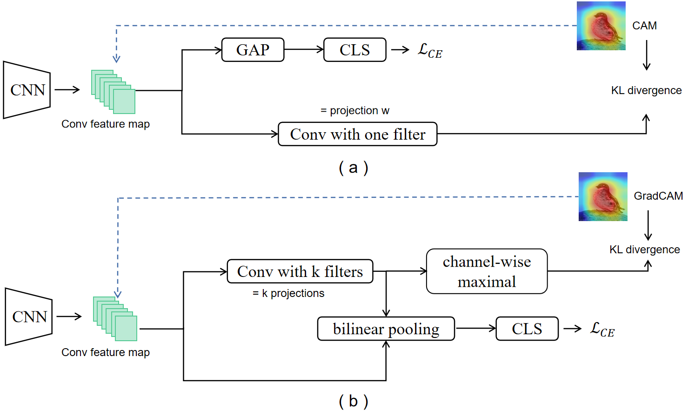

# Improving Fine-Grained Visual Recognition in Low Data Regimes via Self-Boosting Attention Mechanism 
 
This project contains the implementation of SAM for fine-grained visual recognition in low data regimes, as presented in our paper

> Improving Fine-Grained Visual Recognition in Low Data Regimes via Self-Boosting Attention Mechanism,   
> Yangyang Shu, Baosheng Yu, Hai-Ming Xu and Lingqiao Liu*  
> *To be appeared in ECCV 2022*

## Brief Introduction for Self-Boosting Attention Mechanism 
The challenge of fine-grained visual recognition often lies in discovering the key discriminative regions. While such regions can be automatically identified from a large-scale labeled dataset, a similar method might become less effective when only a few annotations are available. In low data regimes, a network often struggles to choose the correct regions for recognition and tends to overfit spurious correlated patterns from the training data.

To tackle this issue, this paper proposes the self-boosting attention mechanism, a novel method for regularizing the network to focus on the key regions shared across samples and classes. Specifically, the proposed method first generates an attention map for each training image, highlighting the discriminative part for identifying the ground-truth object category. Then the generated attention maps are used as pseudo-annotations. The network is enforced to fit them as an auxiliary task. We call this approach the self-boosting attention mechanism (SAM). We also develop a variant by using SAM to create multiple attention maps to pool convolutional maps in a style of bilinear pooling, dubbed SAM-Bilinear.

## Dependencies
* python3.6
* torch == 1.3.1 (with suitable CUDA and CuDNN version)
* torchvision == 0.4.2
* tensorboardX
* numpy
* argparse

## Datasets
| Dataset | Download Link |
| -- | -- |
| CUB-200-2011 | https://paperswithcode.com/dataset/cub-200-2011 |
| Stanford Cars | http://ai.stanford.edu/~jkrause/cars/car_dataset.html |
| FGVC Aircraft | http://www.robots.ox.ac.uk/~vgg/data/fgvc-aircraft/ |


Please download and organize the datasets in this structure:
```
SAM
├── CUB200/
│   ├── train/ 
    ├── test/
    ├── image_list/
├── StanfordCars/
│   ├── train/ 
    ├── test/
    ├── image_list/
├── Aircraft/
│   ├── train/ 
    ├── test/
    ├── image_list/
```

## RUN
- The running commands for several datasets are shown below. Please refer to ``run.sh`` for commands for datasets with other label ratios and label category.
```
python src/main.py  --root ./StanfordCars --batch_size 24 --logdir vis/ --gpu_id 0 --backbone resnet50  --label_ratio 10 --pretrained
python src/main.py  --root ./CUB200 --batch_size 24 --logdir vis/ --gpu_id 1 --backbone resnet50 --label_ratio 10 --pretrained
python src/main.py  --root ./Aircraft --batch_size 24 --logdir vis/ --gpu_id 2 --backbone resnet50 --label_ratio 10 --pretrained

```
Citation
If you find this code or idea useful, please cite our work:
```
@inproceedings{shu2022improving,
  title={Improving Fine-Grained Visual Recognition in Low Data Regimes via Self-Boosting Attention Mechanism},
  author={Shu, yangyang and Liu, Lingqiao and Yu, baosheng and Xu, haiming},
  booktitle={ European Conference on Computer Vision (ECCV)},
  year={2022}
}
```
